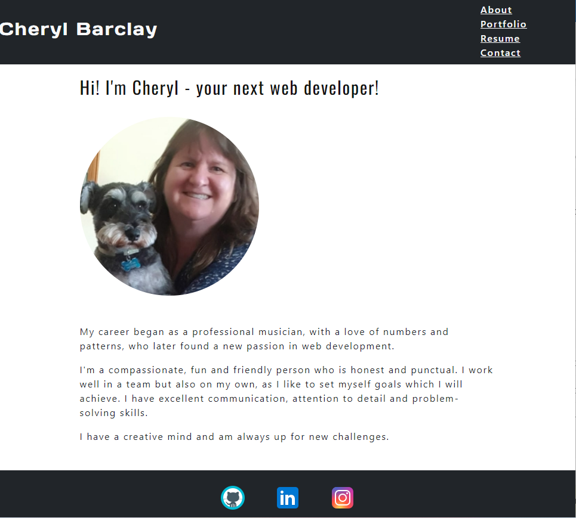

<h1 align="center"> React Profile </h1>
<p align="center">
    
    
    
    
</p>

## Table of Contents
* [Description](#description)
* [User Story](#user-story)
* [Acceptance Criteria](#acceptance-criteria)
* [Screenshots](#screenshots)
* [Technology](#technology) 
* [Installation](#installation) 
* [Usage](#usage) 
* [Features](#features)
* [Heroku Link](#heroku-link)
* [Contact Me](#contact-me)
* [Credits](#credits) 
* [Questions](#questions)
* [License](#license)

## Description
This profile is the first project I have built using React, as part of the Adelaide University Full Stack Coding Bootcamp.
It is still a work in progress as I continue to grow refine my knowledge in coding.
 
## User Story
AS AN employer looking for candidates with experience building single-page applications <br>
I WANT to view a potential employee's deployed React portfolio of work samples<br>
SO THAT I can assess whether they're a good candidate for an open position<br>
 
## Acceptance Criteria
GIVEN a single-page application portfolio for a web developer<br>
WHEN I load the portfolio<br>
THEN I am presented with a page containing a header, a section for content, and a footer<br>
WHEN I view the header<br>
THEN I am presented with the developer's name and navigation with titles corresponding to different sections of the portfolio<br>
WHEN I view the navigation titles<br>
THEN I am presented with the titles About Me, Portfolio, Contact, and Resume, and the title corresponding to the current section is highlighted<br>
WHEN I click on a navigation title<br>
THEN I am presented with the corresponding section below the navigation without the page reloading and that title is highlighted<br>
WHEN I load the portfolio the first time<br>
THEN the About Me title and section are selected by default<br>
WHEN I am presented with the About Me section<br>
THEN I see a recent photo or avatar of the developer and a short bio about them<br>
WHEN I am presented with the Portfolio section<br>
THEN I see titled images of six of the developer’s applications with links to both the deployed applications and the corresponding GitHub repository<br>
WHEN I am presented with the Contact section<br>
THEN I see a contact form with fields for a name, an email address, and a message<br>
WHEN I move my cursor out of one of the form fields without entering text<br>
THEN I receive a notification that this field is required<br>
WHEN I enter text into the email address field<br>
THEN I receive a notification if I have entered an invalid email address<br>
WHEN I am presented with the Resume section<br>
THEN I see a link to a downloadable resume and a list of the developer’s proficiencies<br>
WHEN I view the footer<br>
THEN I am presented with text or icon links to the developer’s GitHub and LinkedIn profiles, and their profile on a third platform (Stack Overflow, Twitter) 

## Screenshots

 
## Technology
This project has been created with:
- React
- Bootstrap

## Installation
To setup the application in local, run `npm i` to install the packages listed in the package.json files. 

## Usage
After installing npm packages, the application will be invoked by using the following command:
```
npm start
```
## Features
* Application uses React to render content.
* Application has a single Header component that appears on multiple pages, with a Navigation component within it that’s used to conditionally render About Me, Portfolio, Contact, and Resume sections.
* Application has a single Project component that’s used multiple times in the Portfolio section. 
* Application has a single Footer component that appears on multiple pages.
* Application is be deployed to GitHub Pages. 

## Heroku Link
[Click here for Heroku Link]()
 
## Contact Me
* GitHub: [CheBar1](https://github.com/CheBar1)
* Email: chebarclay@live.com.au

## Credits
* University of Adelaide - Coding Bootcamp;
* GitHub;
* Youtube;
* Google;
* Stack Overflow.

## Questions
Please send your questions [here](mailto:chebarclay@live.com.au?subject=[GitHub]%20Dev%20Connect) or visit [github/CheBar1](https://github.com/CheBar1).

## License
[](https://opensource.org/licenses/MIT) <br>
This project is licensed under MIT, for more information please visit [this website](https://opensource.org/licenses/MIT)
[this website](https://opensource.org/licenses/MIT)
